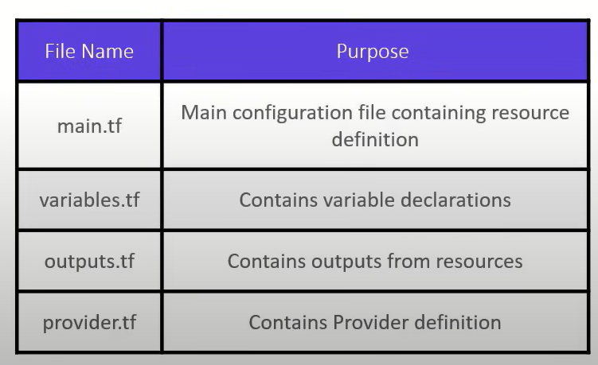

# terraform init
- can be done multiple times, wont affect the infrastructure.
- initialises the provider version
# Directory Nomenclature


# main.tf

```main.tf
terraform {
  required_providers {
    aws = {
      source  = "hashicorp/aws"
      version = "~> 5.0"
    }
  }
}
provider "aws" {
    region = "ap-south-1"
}
```